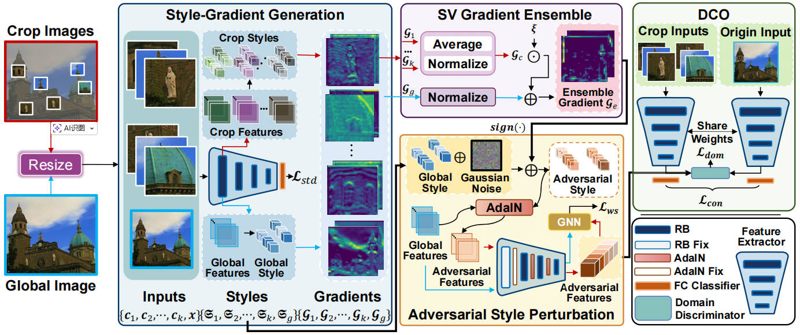

# SVasP: Self-Versatility Adversarial Style Perturbation for Cross-Domain Few-Shot Learning (AAAI25)
Repository for the AAAI25 paper SVasP [[Paper](https://ojs.aaai.org/index.php/AAAI/article/view/33676)]

 <div align="center">

</div>

## Environment Setup
```
# conda env
conda create --name py36 python=3.6
conda activate py36
conda install pytorch torchvision -c pytorch
conda install pandas
pip3 install scipy>=1.3.2
pip3 install tensorboardX>=1.4
pip3 install h5py>=2.9.0
pip3 install tensorboard
pip3 install timm
pip3 install opencv-python==4.5.5.62
pip3 install ml-collections
# code
git clone https://github.com/liwenqianSEU/SVasP.git
cd SVasP
```

## datasets
Our method used 8 popular CD-FSL datasets:
- *mini*-Imagenet.
- CUB, Cars, Places, Plantae, ChestX, ISIC, EuroSAT, and CropDisease. 

For the *mini*-Imagenet, CUB, Cars, Places, Plantae, we refer to the [FWT](https://github.com/hytseng0509/CrossDomainFewShot) repo.

For the ChestX, ISIC, EuroSAT, and CropDisease, we refer to the [BS-CDFSL](https://github.com/IBM/cdfsl-benchmark) repo.

## meta-train SVasP
```
python3 metatrain_SVasP_RN.py --dataset miniImagenet --name SVasP-RN-1shot --train_aug --warmup baseline --n_shot 1 --stop_epoch 200 --n_crops 2 --lambd_crop 0.2

python3 metatrain_SVasP_RN.py --dataset miniImagenet --name SVasP-RN-5shot --train_aug --warmup baseline --n_shot 5 --stop_epoch 200 --n_crops 2 --lambd_crop 0.2
```

## 3.2 fine-tune SVasP
```
python3 finetune_SVasP_RN.py --testset cars --name exp-FT --train_aug --n_shot 1 --finetune_epoch 10 --resume_dir SVasP-RN-1shot --resume_epoch -1

python3 finetune_SVasP_RN.py --testset cars --name exp-FT --train_aug --n_shot 5 --finetune_epoch 50 --resume_dir SVasP-RN-5shot --resume_epoch -1
```

# 5 Citing
If you find our paper or this code useful for your research, please considering cite us:
```
@inproceedings{li2025svasp,
  title={Svasp: Self-versatility adversarial style perturbation for cross-domain few-shot learning},
  author={Li, Wenqian and Fang, Pengfei and Xue, Hui},
  booktitle={Proceedings of the AAAI Conference on Artificial Intelligence},
  volume={39},
  number={15},
  pages={15275--15283},
  year={2025}
}
```

# 6 Acknowledge
Our code is built upon the implementation of [Styleadv](https://github.com/lovelyqian/StyleAdv-CDFSL), [FWT](https://github.com/hytseng0509/CrossDomainFewShot), [ATA](https://github.com/Haoqing-Wang/CDFSL-ATA), and [PMF](https://github.com/hushell/pmf_cvpr22). Thanks for their work.
